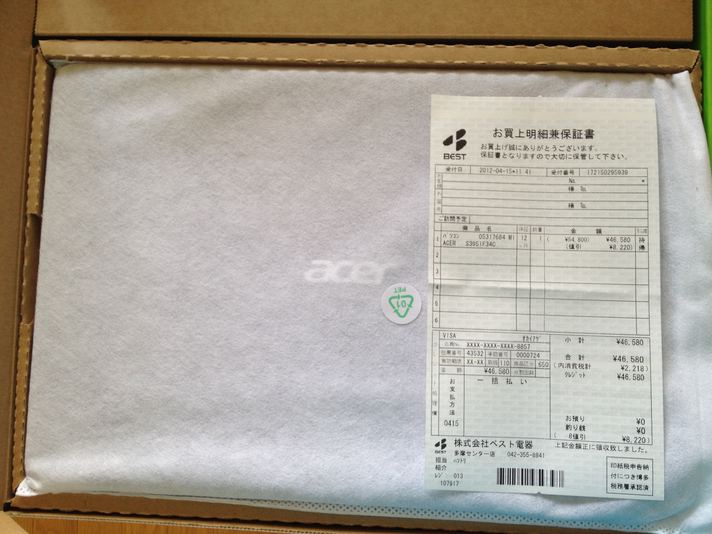
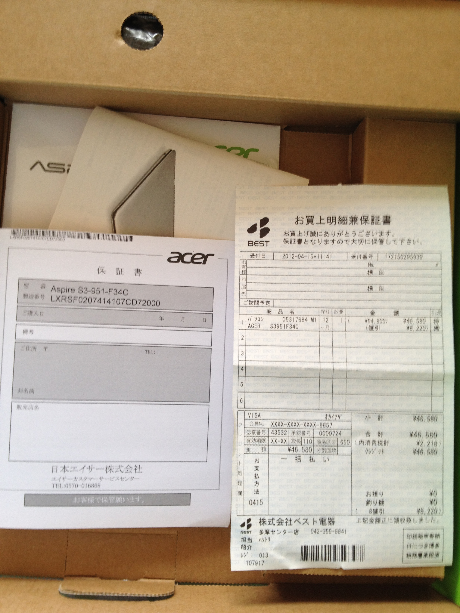

#日本Acerリパヤセンターは、まだそれをかくれんぼ？
<div style="text-align:right">
<a href="./acer.html" title="日本Acer"><i>中文版</i></a>  
<a href="./acer.html" title="日本Acer"><i>台灣正體版</i></a>  
<a href="./acer-ja.html" title="日本Acer"><i>日本語版</i></a> 
</div>

----
- 購入する
- 修理する
- やり取り
  - やり取り一回目
  - やり取り二回目
  - やり取り三回目
    - やり取り三回目の結果
    - もう一度連絡する
  - やり取り四回目：AJC_Call_Agent_065さん
    - 回答
    - やり取り四回目の結論
  - やり取り五回目
    - やり取り五回目の結果
  - やり取り六回目：電話で
  - やり取り七回目 ( **2013-04-02更新** )

----

##購入する

私は2012年4月に東京でAcerのノートパソコン買いました、これです：

>

以下は開梱写真：

>
>
>

実際には、、このラップトップが好きです。かなり良い感じです。

##修理する

しかし、初期の2013年に、それが壊れていました、電源ランプは点灯出来ませんでした。だから私は日本の2月13日エイサーリペヤセンターに電話で連絡して、宅配便でノートブックを送りました。

二週目には、エイサーは私に連絡しました。私は、電源アダプタも宅配便で送りました。

その後、長い待ち時間がありました。ドラマチックな物語が始まった。

二週間後、私は[Acer日本のオンラインサポート](http://acer-jp.custhelp.com/app/account/questions/list)で進捗状況を質問しました。

##やり取り
###やり取り一回目
私：

```
カスタマ 杜 志剛 様 CSS Web 経由 2013年03月08日 01:59 PM
お疲れ様です。

私は先月リペアセンターに連絡して、ノートパソコンを送りました。
修理番号は「３１４４８J 」です。

いま修理中ですか？いつ出来ますか？
教えてお願いします。
```

回答：

```
回答 AJC_Call_Agent_063 メール 経由 2013年03月08日 07:20 PM
日頃より弊社製品をご愛用いただき、誠にありがとうございます。 
日本エイサーカスタマーサービスセンターでございます。

修理製品の出荷時期についてでございますが、弊社担当部署へ
確認を取らせていただきましたところ、3月12日出荷見込みとして
準備を進めさせていただいている状況でございます。

　※万が一、作業が滞った場合などは、あらためて
　　 ご連絡さしあげる場合がございます。

。。。
```
**然し、3月12日出荷しませんでした、私に連絡しませんでした。**

###やり取り二回目
私：

```
カスタマ 杜 志剛 様 CSS Web 経由 2013年03月14日 07:18 PM
すみません、

修理番号は「３１４４８J 」です。

いま修理中ですか？いつ出荷しますか？
教えてお願いします。
```

回答：

```
回答 AJC_Call_Agent_063 メール 経由 2013年03月14日 08:54 PM
日頃より弊社製品をご愛用いただき、誠にありがとうございます。 
日本エイサーカスタマーサービスセンターでございます。

このたびは大変ご不便をおかけし、申し訳ございません。

前回お問い合わせをいただいた際に3月12日出荷見込みであることを
ご案内差し上げておりましたが、改めて修理部署へ確認させていただいたところ、
修理点検作業にお時間をいただいてしまっている状況でございます。

3月17日ごろの出荷見込みで作業中ございますので、
お客様にはお時間をいただいており、誠に恐縮でございますが
何とぞ今しばらくお待ちくださいますようお願い申しあげます。
```

**「3月12日出荷」** は **「3月17日」** になりました。
**然し、3月17日出荷しませんでした、私に連絡もしませんでした。**

###やり取り三回目

私：

```
カスタマ 杜 志剛 様 CSS Web 経由 2013年03月17日 10:39 PM
AJC_Call_Agent_063 さん

失礼します、すみません、
ちょうど不便ですので、今の進捗状況を教えて頂きませんか？

よろしくお願いいたします。
```

自動返信：

```
お客様のリクエストを受け付けました。営業時間は午前9時から午後9時までと
なります。（弊社規定の休日を除く）営業時間外のお問い合わせにつきまして
は営業開始後12時間以内にご回答を差し上げます。今しばらくお待ちくださ
い.
```
####やり取り三回目の結果
 * **しかし、返信しませんでした**

####もう一度連絡する

私：

```
カスタマ 杜 志剛 様 CSS Web 経由 2013年03月18日 12:41 PM
すみません、
今の進捗状況を教えて頂きませんか？

よろしくお願いいたします。
```
**AJC_Call_Agent_063さん** はその時後今まで回答しません。

###やり取り四回目：AJC_Call_Agent_065さん

私の質問：

```
カスタマ 杜 志剛 様 CSS Web 経由 2013年03月18日 04:46 PM
お疲れ様です。

私は２月１４日リペアセンターに連絡して、ノートパソコンを送りました。
修理番号は「３１４４８J 」です。

いま修理中ですか？いつ出来ますか？
教えてお願いします。
```

####回答
```
回答 AJC_Call_Agent_065 メール 経由 2013年03月18日 08:54 PM
日頃より弊社製品をご愛用いただき、誠にありがとうございます。 
日本エイサーカスタマーサービスセンターでございます。

お問い合わせいただいた件について、以下にご案内いたします。

================================================== 

　1) 修理進捗状況について

================================================== 

このたびは、お客様にはご迷惑をおかけいたしておりまして、
誠に申しわけございません。

修理進捗状況につきましては、大変恐縮な次第でございますが
現在、最終点検を実施いたしており、今週末ころに出荷予定と
なっている次第でございます。

お急ぎとのことで、大変心苦しいご案内とはなりますが、
製品のご返送まで、いましばらくお待ちいただきますよう
何とぞよろしくお願い申しあげます。
```
####やり取り四回目の結論
 * 良かった、 **週末(3月24日まで)** 出荷ですね！

###やり取り五回目
私は非常に心配して、「この週末は本当に私のノートパソコンを与えた？」
確認したいです。だから、別の質問をしました:

```
カスタマ 杜 志剛 様 CSS Web 経由 2013年03月22日 09:11 PM
お疲れ様です。

私は先月リペアセンターに連絡して、ノートパソコンを送りました。
修理番号は「３１４４８J 」です。

2013年03月08日　AJC_Call_Agent_063 さんの返信：
　　　3月12日出荷見込みとして
　　　準備を進めさせていただいている状況でございます。
2013年03月14日　AJC_Call_Agent_063 さんの返信：
　　　3月17日ごろの出荷見込みで作業中ございます...
2013年03月18日　AJC_Call_Agent_065 さんの返信：
　　　現在、最終点検を実施いたしており、
　　　今週末ころに出荷予定.....

***遅延三回***でしたので、
今回四回目遅延は駄目です、必ず明日まで出荷します。

宜しくお願い致します
```

あれ！今回は「滞った」ではなくで、 **「わからない」** と答えた：

```
回答 AJC_Call_Agent_007 メール 経由 2013年03月23日 05:57 PM
日頃より弊社製品をご愛用いただき、誠にありがとうございます。 
日本エイサーカスタマーサービスセンターでございます。

修理完了後の納期につきまして、誠に申し訳ございませんが
当窓口にて詳細な情報を持ち合わせておりませんので
担当部署へ確認をさせていただきたく存じます。

お急ぎの場合は申し訳ございませんが、確認がとれ次第
お客様へあらためてご連絡をさせていただきますので
何とぞお待ちいただけますようお願い申しあげます。

```
あれ！
**「3月12日出荷」**ではなくで、 **「3月17日出荷」** ではなくで、 **「3月24日出荷」** ではなくで、
実は **「はわからない」** ？
何度も何度も滞った！私は非常に怒っていました。

```
カスタマ 杜 志剛 様 CSS Web 経由 2013年03月23日 10:48 PM
AJC_Call_Agent_007さん

前に質問した時、AJC_Call_Agent_063さんとAJC_Call_Agent_065さんは「XX日出荷。。。」といいました。
だから、AJC_Call_Agent_063さんとAJC_Call_Agent_065さんは納期がわかります。
何故AJC_Call_Agent_007さんはわかりませんか？
はやくパソコンを返してください。

もし修理出来なければ、あなたたちもパソコンを返してください。

兎に角、パソコンを返してください。
```
回答：

```
回答 AJC_Call_Agent_007 メール 経由 2013年03月24日 02:44 PM
日頃より弊社製品をご愛用いただき、誠にありがとうございます。 
日本エイサーカスタマーサービスセンターでございます。
このたびは修理納期について、お客様にご不便を
お掛けいたしておりますことを、あらためてお詫び申しあげます。

誠に恐れ入りますが、本件につきましては当窓口にて
修理の遅れに関する情報を持ち合わせておりませんので、
現在担当部署へ確認をさせていただいております。

お手数をお掛けいたしますが、
何とぞご容赦賜りますようお願い申しあげます。 
```

####やり取り五回目の結果
 * AJC_Call_Agent_007さんは詳細情報が知りませんでしは。
 * AJC_Call_Agent_007さんは担当者に確認します ***（本当？）*** 。

結果は？わかりません。
多分AJC_Call_Agent_007さんは今まで確認しています？
その件はとても複雑なんですか？
**AJC_Call_Agent_007さんは私に連絡しません。**

###やり取り六回目：電話で
3月26日私はもう一回電話をしました。あの側は親切な女性です。然し彼女は状況が何も分からなっかた、何も知らなかった。
彼女は私と **約束** しました: **「次の日Acerの情報を持ている人は私に電話で説明します」** 。

次の日は3月27日ですね。
**但し、今日までAcerは私に連絡しませんでした。**

-----
** 下記２０１３年４月０２日２３：００の更新： **

###やり取り七回目
今日私はも一回メールを送りましは。今回Acer側 ***AJC_Call_Agent_063さん*** は担当者ですね。
今回速く返信しました。でも、内容は「了解、確認中」だけです。
下記メールです：

```
カスタマ Web フォーム (杜 志剛様) - 2013年04月02日 08:56 PM
AJC_Call_Agent_007さん

先月の話、「現在担当部署へ確認をさせていただいております。」
現在どうですか？確認しましたか？
いつ返しますか?

Acerは数回約束を守らなかった、
信頼を失いましたよ。

俺はその問題を公開で解決したいので、
自分のWeb Siteで公開しました:
  http://www.dulao5.com/acer-ja.html

以上
よろしくお願い致します。
```

下記は回答です：

```
回答 メール経由(AJC_Call_Agent_063) - 2013年04月02日 10:10 PM
日頃より弊社製品をご愛用いただき、誠にありがとうございます。
日本エイサーカスタマーサービスセンターでございます。

本件は確認のため、回答までしばらくお時間をいただきたく存じます。

お急ぎの場合は申し訳ございませんが、弊社にて確認がとれ次第
お客様へあらためてご連絡をさせていただきますので
何とぞお待ちいただけますようお願い申しあげます。
```

下記は私の質問です：

```
カスタマ 杜 志剛 様 CSS Web 経由 2013年04月02日 11:14 PM
AJC_Call_Agent_063さんですか？
しばらくですね。

* 問題A. ご名前は何ですか？

下記は三月０８日の話ですね：
「
　　　2013年03月08日　AJC_Call_Agent_063 さんの返信：
　　　　　3月12日出荷見込みとして
　　　　　準備を進めさせていただいている状況でございます。
　　　2013年03月14日　AJC_Call_Agent_063 さんの返信：
　　　　　3月17日ごろの出荷見込みで作業中ございます...
」

* 問題B. なぜ3月17日出荷できませんでしたか？原因は何ですか？
3月17日出荷の担当者の名前は何ですか？

* 問題C. 前に最後のメールは、AJC_Call_Agent_007さんは何故長い時間で確認出来ませんか？何故私に回答しませんか？

* 問題D. 今回AJC_Call_Agent_063さんは「確認と回答」の担当者ですね、確認はどのぐないかかりますか？

すみません、今回の回答前に、とりあえず問題ABCDを教えてください！

俺はその問題を公開で解決したいので、
すぐ自分のWeb Siteを更新しましょう！
http://www.dulao5.com/acer-ja.html　（少し時間がかかります、ちょうど待てしてください）
```


