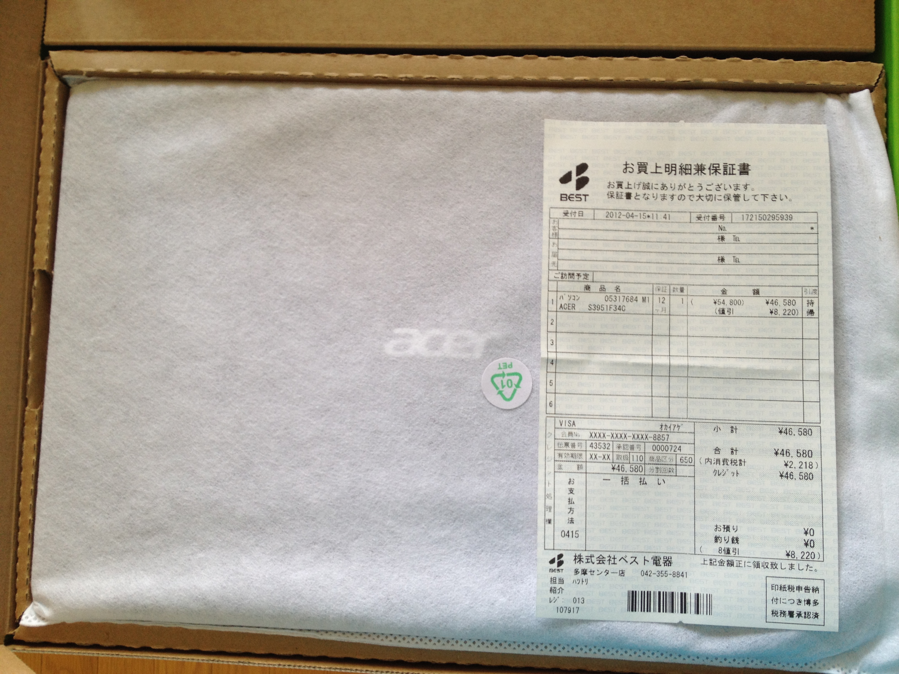

#宏基日本维修中心，还在躲猫猫吗？

##购买

2012年4月我在东京买了一台Acer笔记本，就是这款。

> 

以下是开箱照片：

> 
> 
> 

实际上，这台笔记本用了近一年，感觉还不错，很轻便。

##维修

但是，2013年初它坏了，点不亮了。于是我2月13日报修。电话联络了宏基日本维修中心，沟通完毕后将笔记本通过快递发到了他们那里。

到了第二周，我根据对方的联络，把电源适配器也快递过去了。

接下来就是漫长的等待，故事就有些戏剧性了。

两周后我电话询问他们，但是电话打不通，于是我搜索宏基日本的互联网服务信息，利用[这个在线咨询网站](http://acer-jp.custhelp.com/app/account/questions/list)去问进度情况。

##沟通

###第一次沟通

我：

```
カスタマ 杜 志剛 様 CSS Web 経由 2013年03月08日 01:59 PM
お疲れ様です。

私は先月リペアセンターに連絡して、ノートパソコンを送りました。
修理番号は「３１４４８J 」です。

いま修理中ですか？いつ出来ますか？
教えてお願いします。
```

回复：

```
回答 AJC_Call_Agent_063 メール 経由 2013年03月08日 07:20 PM
日頃より弊社製品をご愛用いただき、誠にありがとうございます。 
日本エイサーカスタマーサービスセンターでございます。

修理製品の出荷時期についてでございますが、弊社担当部署へ
確認を取らせていただきましたところ、3月12日出荷見込みとして
準備を進めさせていただいている状況でございます。

　※万が一、作業が滞った場合などは、あらためて
　　 ご連絡さしあげる場合がございます。

。。。
```
####第一次沟通的结论####
 1. 3月12日出荷見込み
 2. 如果出现延迟，会联络我。

但是，到了3月14日，还是没动静。

####第一次沟通的结果####
 1. 3月12日没有出货
 2. 发生延迟了，但并没有联络我

于是又有了下面的沟通。

###第二次沟通###
我：

```
カスタマ 杜 志剛 様 CSS Web 経由 2013年03月14日 07:18 PM
すみません、

修理番号は「３１４４８J 」です。

いま修理中ですか？いつ出荷しますか？
教えてお願いします。
```

回复：

```
回答 AJC_Call_Agent_063 メール 経由 2013年03月14日 08:54 PM
日頃より弊社製品をご愛用いただき、誠にありがとうございます。 
日本エイサーカスタマーサービスセンターでございます。

このたびは大変ご不便をおかけし、申し訳ございません。

前回お問い合わせをいただいた際に3月12日出荷見込みであることを
ご案内差し上げておりましたが、改めて修理部署へ確認させていただいたところ、
修理点検作業にお時間をいただいてしまっている状況でございます。

3月17日ごろの出荷見込みで作業中ございますので、
お客様にはお時間をいただいており、誠に恐縮でございますが
何とぞ今しばらくお待ちくださいますようお願い申しあげます。
```
####第二次沟通的结论####
 * 3月12日出货改成了3月17日
 
但是到了3月17日，我还是没有收到出货的通知。
####第二次沟通的结果####
 * 3月17日未出货

###第三次沟通###

我：

```
カスタマ 杜 志剛 様 CSS Web 経由 2013年03月17日 10:39 PM
AJC_Call_Agent_063 さん

失礼します、すみません、
ちょうど不便ですので、今の進捗状況を教えて頂きませんか？

よろしくお願いいたします。
```
####第三次沟通结果####
 * 对方没有在12小时内回复我。

####再次尝试询问####

我：

```
カスタマ 杜 志剛 様 CSS Web 経由 2013年03月18日 12:41 PM
すみません、
今の進捗状況を教えて頂きませんか？

よろしくお願いいたします。
```
**AJC_Call_Agent_063**先生没有回答，他从此没有再露面。

###第四次沟通：AJC_Call_Agent_065先生 ###

我的询问：

```
カスタマ 杜 志剛 様 CSS Web 経由 2013年03月18日 04:46 PM
お疲れ様です。

私は２月１４日リペアセンターに連絡して、ノートパソコンを送りました。
修理番号は「３１４４８J 」です。

いま修理中ですか？いつ出来ますか？
教えてお願いします。
```

####回答####
```
回答 AJC_Call_Agent_065 メール 経由 2013年03月18日 08:54 PM
日頃より弊社製品をご愛用いただき、誠にありがとうございます。 
日本エイサーカスタマーサービスセンターでございます。

お問い合わせいただいた件について、以下にご案内いたします。

================================================== 

　1) 修理進捗状況について

================================================== 

このたびは、お客様にはご迷惑をおかけいたしておりまして、
誠に申しわけございません。

修理進捗状況につきましては、大変恐縮な次第でございますが
現在、最終点検を実施いたしており、今週末ころに出荷予定と
なっている次第でございます。

お急ぎとのことで、大変心苦しいご案内とはなりますが、
製品のご返送まで、いましばらくお待ちいただきますよう
何とぞよろしくお願い申しあげます。
```
####第四次沟通的结论####
 * 回答是令人振奋的，本周末就会出货了。

###第五次沟通###
我很担心，这个周末真的给我发货吗？再次发问，希望这次真的不要再拖延了：

```
カスタマ 杜 志剛 様 CSS Web 経由 2013年03月22日 09:11 PM
お疲れ様です。

私は先月リペアセンターに連絡して、ノートパソコンを送りました。
修理番号は「３１４４８J 」です。

2013年03月08日　AJC_Call_Agent_063 さんの返信：
　　　3月12日出荷見込みとして
　　　準備を進めさせていただいている状況でございます。
2013年03月14日　AJC_Call_Agent_063 さんの返信：
　　　3月17日ごろの出荷見込みで作業中ございます...
2013年03月18日　AJC_Call_Agent_065 さんの返信：
　　　現在、最終点検を実施いたしており、
　　　今週末ころに出荷予定.....

遅延三回でしたので、
今回四回目遅延は駄目です、必ず明日まで出荷します。

宜しくお願い致します
```
结果，回复让人大跌眼镜。不再是拖延，而是回答「不知道」了：

```
回答 AJC_Call_Agent_007 メール 経由 2013年03月23日 05:57 PM
日頃より弊社製品をご愛用いただき、誠にありがとうございます。 
日本エイサーカスタマーサービスセンターでございます。

修理完了後の納期につきまして、誠に申し訳ございませんが
当窓口にて詳細な情報を持ち合わせておりませんので
担当部署へ確認をさせていただきたく存じます。

お急ぎの場合は申し訳ございませんが、確認がとれ次第
お客様へあらためてご連絡をさせていただきますので
何とぞお待ちいただけますようお願い申しあげます。

```
我很生气，一而再再而三的拖延，最后又推拖逶迤，变成不知道了。
如果宏基不能修理，把不能修的笔记本还给我好了：

```
カスタマ 杜 志剛 様 CSS Web 経由 2013年03月23日 10:48 PM
AJC_Call_Agent_007さん

前に質問した時、AJC_Call_Agent_063さんとAJC_Call_Agent_065さんは「XX日出荷。。。」といいました。
だから、AJC_Call_Agent_063さんとAJC_Call_Agent_065さんは納期がわかります。
何故AJC_Call_Agent_007さんはわかりませんか？
はやくパソコンを返してください。

もし修理出来なければ、あなたたちもパソコンを返してください。

兎に角、パソコンを返してください。
```
回复照样打太极拳：

```
回答 AJC_Call_Agent_007 メール 経由 2013年03月24日 02:44 PM
日頃より弊社製品をご愛用いただき、誠にありがとうございます。 
日本エイサーカスタマーサービスセンターでございます。
このたびは修理納期について、お客様にご不便を
お掛けいたしておりますことを、あらためてお詫び申しあげます。

誠に恐れ入りますが、本件につきましては当窓口にて
修理の遅れに関する情報を持ち合わせておりませんので、
現在担当部署へ確認をさせていただいております。

お手数をお掛けいたしますが、
何とぞご容赦賜りますようお願い申しあげます。 
```

####第五次沟通结果####
 * 对方不知道情况。
 * 对方要去找具体负责人确认情况。

结果您肯定猜到了把，到现在也没回复我。 **AJC_Call_Agent_007**先生要找具体负责人确认，确认这件事相必非常复杂吧。

### 第六次，电话沟通 ###
从互联网上玩躲猫猫，我腻歪了。于是3月26日，我又打了一次电话。这次通了。接线的人说，她什么都不知道，什么时候修好也不知道，具体情况也不明了。她许诺第二天让知道情况的人给我回电话。

不过，直到今天，我也没有接到「知道情况的人」给我打的电话。

